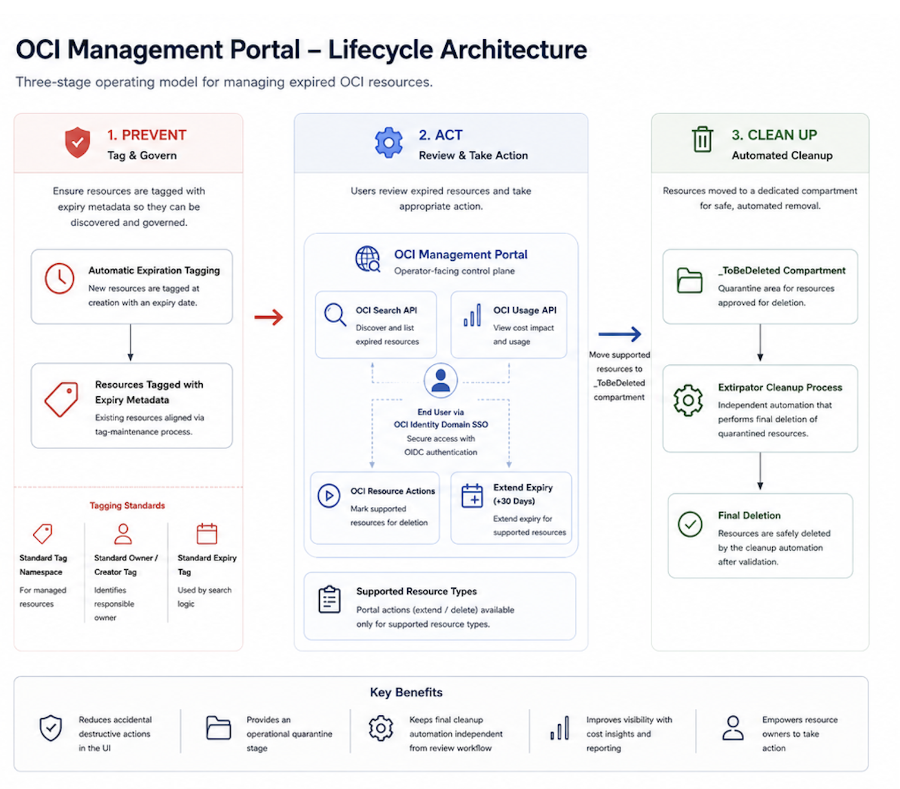
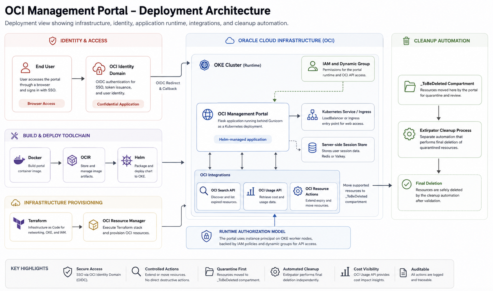
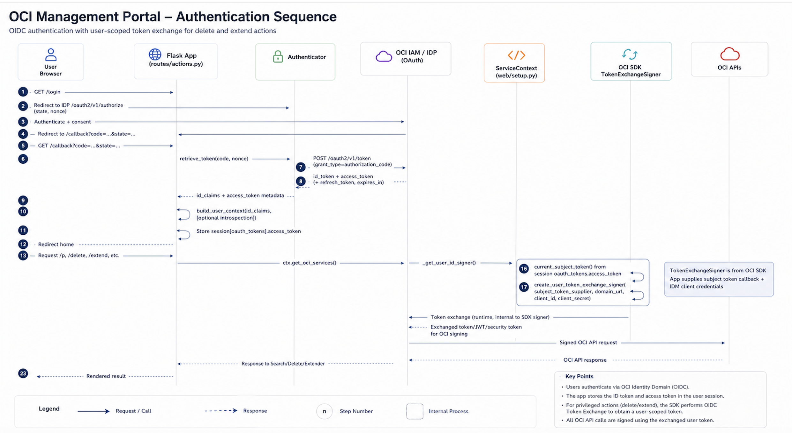

# OCI Management Portal

OCI Management Portal is a Flask web application for discovering and managing OCI resources tagged for ownership and lifecycle control. It supports authenticated user views, search/filter flows, resource expiry extension, and managed delete workflows.

Use this README to configure, run locally (Flask or Gunicorn), deploy on Oracle Linux, or build and run the container image.

## Table of Contents

1. [Recommended Reading Order](#recommended-reading-order)
2. [What This Solution Does](#what-this-solution-does)
3. [Architecture Diagrams](#architecture-diagrams)
4. [Architecture Explanation](#architecture-explanation)
5. [Authentication and User-Scoped OCI Flow](#authentication-and-user-scoped-oci-flow)
6. [Core Components](#core-components)
7. [Repository Layout](#repository-layout)
8. [Project Dependencies](#project-dependencies)
9. [Related Project Dependencies](#related-project-dependencies)
10. [Summary](#summary)
11. [Opening Issues](#opening-issues)
12. [Contributing](#contributing)

## Recommended Reading Order

For a new operator or reviewer, use this order:

1. Read this README first to understand the purpose, architecture, authentication model, core components, configuration, and related lifecycle dependencies.
2. Use [DEPLOYMENT_GUIDE.md](DEPLOYMENT_GUIDE.md) when you are ready to deploy the production stack with OCI Resource Manager and Helm.
3. Use [LOCAL_DEPLOYMENT_GUIDE.md](LOCAL_DEPLOYMENT_GUIDE.md) for detailed workstation, confidential app, and single-host manual deployment notes.
4. Use [deploy/README.md](deploy/README.md) for Terraform and OCI Resource Manager infrastructure details.
5. Use the Helm documentation under [deploy/helm/oci-management-portal](deploy/helm/oci-management-portal/) for chart-specific deployment, values, and operational runbooks.

## What This Solution Does

At a high level, the OCI Management Portal helps platform and tenancy administrators manage expired OCI resources safely.

Key business outcomes:

- Gives users a single portal to review expired resources that belong to them.
- Uses OCI Identity Domain single sign-on for authenticated access.
- Filters results using OCI Search and defined tags.
- Allows resource owners to extend expiry by 30 days.
- Allows resource owners to mark supported resources for deletion by moving them to a cleanup compartment.
- Shows cost visibility for expired resources to improve decision-making.
- Provides CSV export for reporting and operational follow-up.

The overall lifecycle supported by this solution is:

1. Prevent stale infrastructure by maintaining an expiry-tagging model.
2. Detect expired resources through OCI Search.
3. Allow resource owners to review, extend, or mark resources for deletion.
4. Move resources marked for deletion into a quarantine or cleanup compartment.
5. Let a downstream cleanup utility remove those quarantined resources in an automated and controlled manner.

This makes the portal part of a larger governance workflow rather than a standalone UI.

## Architecture Diagrams

The following diagrams are the primary architecture references for this project. They show the solution from two complementary viewpoints:

- lifecycle architecture,
- deployment architecture.

Use the lifecycle diagram first when explaining the business process. Use the deployment architecture when explaining how the infrastructure and application are deployed in OCI. The authentication sequence is included later in [Authentication and User-Scoped OCI Flow](#authentication-and-user-scoped-oci-flow), where it has the right operational context.

### Lifecycle Architecture



The lifecycle architecture shows the controlled three-stage operating model used by the OCI Management Portal:

- **Prevent**: standardize expiry tagging so resources can be discovered and governed.
- **Act**: allow users to review expired resources in the portal, inspect cost impact, extend expiry, or mark supported resources for deletion.
- **Clean Up**: move approved resources into `_ToBeDeleted` and allow Extirpator to perform final cleanup automation.

This diagram is the best high-level view for non-technical readers because it explains why the portal exists and how it fits into the larger expiration management program.

### Deployment Architecture



The deployment architecture shows how the portal is deployed and operated in OCI. It connects the major deployment concerns:

- identity and access,
- build and deploy toolchain,
- infrastructure provisioning,
- OKE runtime,
- OCI integrations,
- runtime authorization,
- cleanup automation.

This diagram is the best implementation view for operators because it shows how Terraform, OCI Resource Manager, OCIR, Helm, OKE, IAM, OCI APIs, and Extirpator fit together.

## Architecture Explanation

The solution follows a three-stage operating model.

### 1. Prevent

The preventative part of the workflow relies on an expiry tag model in OCI. New resources are expected to receive an expiry value through the tenancy's tagging process. Existing resources can be aligned by a separate tag-maintenance tool.

In practical terms, this means the portal works best when:

- there is a standard tag namespace for managed resources,
- there is a standard owner or creator tag,
- there is a standard expiry tag used by the search logic.

### 2. Act

The OCI Management Portal is the operator-facing control plane.

After a user signs in through OCI Identity Domain SSO, the application:

- determines the user identity,
- builds or uses a predefined OCI Search query,
- lists only the resources relevant to that user and the expiry condition,
- optionally shows cost impact for expired resources,
- lets the user extend supported resources,
- lets the user mark supported resources for deletion.

The delete path is intentionally controlled. The portal does not simply destroy everything directly. Instead, for supported resource types, it moves the resource to a designated cleanup compartment where a downstream cleanup process can handle final removal.

### 3. Clean Up

The cleanup stage is handled by a separate automation component called Extirpator. That process is not implemented inside this repository, but the portal is designed to hand off resources to it by moving them into the `_ToBeDeleted` compartment.

This separation is important because it:

- reduces accidental destructive actions in the UI,
- allows an operational quarantine stage,
- keeps final cleanup automation independent from the review workflow.

## Authentication and User-Scoped OCI Flow

Authentication is a core part of the portal because the application is intended to show users the resources they are responsible for and then allow controlled lifecycle actions. The portal uses OCI Identity Domain OIDC for browser login and can use OCI SDK token exchange for user-scoped resource operations.



The authentication sequence shows how browser login, OCI Identity Domain OIDC, application session handling, and OCI SDK token exchange work together. It is especially useful when validating SSO behavior, callback configuration, and user-scoped OCI actions.

At a practical level, the authentication flow works like this:

1. The user opens the portal and selects login.
2. The Flask application redirects the user to the OCI Identity Domain authorization endpoint.
3. The user authenticates with OCI Identity Domain credentials.
4. OCI Identity Domain redirects the browser back to the portal callback endpoint.
5. The application validates the returned state and nonce.
6. The application retrieves token data from the Identity Domain token endpoint.
7. The application builds the portal user context from ID token claims and, when needed, token introspection.
8. The application stores required user/session context in the server-side session backend.
9. When the user requests search, delete, extend, or related actions, the portal obtains the active OCI service context.
10. For user-scoped OCI calls, the application uses the current subject token with OCI SDK `TokenExchangeSigner`.
11. The SDK signs OCI API requests with exchanged token material.
12. OCI APIs process the signed request and return the result to the portal.
13. The portal renders the final result back to the user.

The important operational detail is that sensitive token material is handled server-side. It is not stored in browser local storage. For multi-pod deployments, server-side session storage must be shared through Redis or Valkey so user sessions remain available across pods.

User-scoped OCI calls are useful when privileged actions should be traceable to the authenticated user identity. In that mode, the portal still performs normal application-level checks, such as ownership validation and supported-resource validation, but the OCI SDK signer is created from the user session token flow rather than only from the application runtime identity.

## Core Components

The project is made up of the following major components.

### 1. Web application

The portal itself is a Flask application running behind Gunicorn.

Primary responsibilities:

- render the UI,
- manage login and logout,
- maintain server-side user sessions,
- expose health and readiness endpoints,
- serve search results,
- trigger extend and delete actions.

Relevant implementation areas:

- `src/wsgi.py`
- `src/modules/web/setup.py`
- `src/modules/web/routes/pages.py`
- `src/modules/web/routes/actions.py`

### 2. Authentication and SSO

The application uses OCI Identity Domain OIDC for authentication. Terraform in the `deploy/` directory can create the confidential application required for this login flow.

Primary responsibilities:

- redirect users to sign in,
- validate the callback,
- establish session context,
- optionally support user-scoped OCI calls using token exchange.

Relevant implementation areas:

- `src/modules/authenticator/`
- `src/modules/signer.py`
- `deploy/confidential_application.tf`

### 3. Search engine for expired resources

The portal uses OCI Search to find resources based on tags, resource type, region, and expiry-related logic.

Primary responsibilities:

- build search queries,
- search across subscribed OCI regions,
- filter results,
- enrich results with compartment path information,
- validate whether a resource belongs to the current user.

Relevant implementation areas:

- `src/modules/search/search.py`
- `src/modules/search/query.py`
- `src/modules/search/filter.py`
- `src/modules/search/compartment_mapper/`

### 4. Lifecycle action handlers

These modules perform the resource actions exposed by the UI.

Primary responsibilities:

- extend resource expiry for supported resource types,
- move supported resources to the cleanup compartment,
- track resulting OCI work requests where applicable.

Relevant implementation areas:

- `src/modules/actions/extend/`
- `src/modules/actions/delete/`
- `src/modules/request_chaser/`

### 5. Cost visibility service

The application includes a cost service that retrieves recent usage cost data from OCI Usage API and caches it for display in the portal.

Primary responsibilities:

- load and cache cost data,
- support readiness behavior during startup,
- provide month-to-date or recent cost visibility for expired resources.

Relevant implementation area:

- `src/modules/cost/cost_service.py`

### 6. Terraform infrastructure layer

The Terraform configuration creates the OCI infrastructure needed to host the application on OKE and to support SSO.

Primary responsibilities:

- create VCN and subnets,
- create NSGs and route tables,
- create OKE cluster and node pool,
- create optional IAM policies,
- create the OCI Identity Domain confidential application,
- create the JWT identity propagation trust.

Relevant implementation areas:

- `deploy/networking.tf`
- `deploy/okecluster_node.tf`
- `deploy/iam_policies.tf`
- `deploy/confidential_application.tf`

### 7. Helm chart

The Helm chart packages the application deployment for Kubernetes.

Primary responsibilities:

- deploy the container image,
- create ConfigMap and Secret resources,
- configure probes,
- expose the service,
- optionally enable ingress, HPA, and PDB.

Relevant implementation areas:

- `deploy/helm/oci-management-portal/Chart.yaml`
- `deploy/helm/oci-management-portal/values.yaml`
- `deploy/helm/oci-management-portal/templates/`

## Repository Layout

```text
oci-management-portal-development/

├── Dockerfile
├── sample.env
├── deploy/
│   ├── confidential_application.tf
│   ├── data.tf
│   ├── iam_policies.tf
│   ├── locals.tf
│   ├── networking.tf
│   ├── okecluster_node.tf
│   ├── outputs.tf
│   ├── providers.tf
│   ├── schema.yaml
│   ├── variables.tf
│   ├── versions.tf
│   └── helm/
│       └── oci-management-portal/
│           ├── .helmignore
│           ├── Chart.yaml
│           ├── values.example.yaml
│           ├── values.yaml
│           └── templates/
│               ├── NOTES.txt
│               ├── _helpers.tpl
│               ├── configmap.yaml
│               ├── deployment.yaml
│               ├── hpa.yaml
│               ├── ingress.yaml
│               ├── pdb.yaml
│               ├── secret.yaml
│               ├── service.yaml
│               └── serviceaccount.yaml
├── docs/images/
└── src/
    ├── gunicorn.config.py
    ├── requirements.txt
    ├── wsgi.py
    ├── modules/
    │   ├── __init__.py
    │   ├── config.py
    │   ├── handlers.py
    │   ├── signer.py
    │   ├── utils.py
    │   ├── actions/
    │   │   ├── __init__.py
    │   │   ├── client_bundle.py
    │   │   ├── lazy_client_map.py
    │   │   └── result.py
    │   ├── authenticator/
    │   │   ├── __init__.py
    │   │   └── authenticator.py
    │   ├── cost/
    │   │   └── cost_service.py
    │   ├── request_chaser/
    │   │   ├── __init__.py
    │   │   └── work_request_chaser.py
    │   ├── search/
    │   │   ├── __init__.py
    │   │   ├── filter.py
    │   │   ├── query.py
    │   │   └── search.py
    │   └── web/
    │       ├── __init__.py
    │       ├── setup.py
    │       └── utils.py
    ├── session/
    ├── static/
    │   ├── app.css
    │   ├── bootstrap.bundle.min.js
    │   ├── bootstrap.min.css
    │   ├── favicon.ico
    │   ├── htmx.min.js
    │   ├── primary.min.js
    │   ├── resources.js
    │   └── sort.js
    └── templates/
        ├── base.html
        ├── cards.html
        ├── index.html
        ├── issues.html
        ├── resources.html
        └── components/
            ├── button.html
            ├── card.html
            └── cost_updates.html
```

## Project Dependencies

This section lists the runtime prerequisites needed to start the app.

### Python

- **Required Python version:** `3.11+`
- The project Docker image is built from `python:3.11-slim`, and local examples use `python3.11`.

### Required top-level Python packages

Install with:

```bash
pip install -r src/requirements.txt
```

Core direct dependencies used by this app:

- `Flask` – web application framework
- `Flask-Session` – server-side session management
- `cachelib` – filesystem cache backend used by session handling
- `redis` – shared session backend for Redis/Valkey deployments
- `oci` – Oracle Cloud Infrastructure Python SDK
- `requests` – HTTP calls for OIDC token and userinfo/introspection flows
- `PyJWT` – ID token decode/validation (`import jwt`)
- `gunicorn` – WSGI server for production/prod-like runs

All pinned package versions (including transitive support libs) are in `src/requirements.txt`.

### Other runtime requirements

- **OCI access configuration** (auth mode + credentials), via environment variables documented in [Configuration](#configuration)
- **Identity Domain / OIDC app** values (`OCI_MGMT_DASH_IDM_ENDPOINT`, `OCI_MGMT_DASH_CLIENT_ID`, `OCI_MGMT_DASH_CLIENT_SECRET`)
- **Tag/filter configuration** (`OCI_MGMT_DASH_TAG_NAMESPACE`, `OCI_MGMT_DASH_TAG_KEY`, `OCI_MGMT_DASH_FILTER_KEY`, etc.)
- **Session backend requirement:**
  - `filesystem` (default) for single-node use, or
  - Redis/Valkey plus `OCI_MGMT_DASH_SESSION_REDIS_URL` for multi-pod/shared sessions
- **For Docker run path:** Docker/Podman runtime available locally

## Related Project Dependencies

This project depends on two companion projects for lifecycle operations. The portal initiates and tracks lifecycle actions, while these companion tools perform key backend enforcement tasks that keep resource hygiene and expiry policy automation working end-to-end:

1. **Cleanup compartment asset removal**: <https://github.com/therealcmj/ociextirpater>
   - The portal’s delete flow moves eligible resources into a cleanup compartment.
   - `ociextirpater` is the downstream cleanup engine that removes those moved assets, preventing long-lived buildup and completing the deletion lifecycle.
2. **Expiry tag updates via tag defaults**: <https://github.com/flynnkc/tag-updater>
   - The portal’s extend flow relies on standardized expiry tagging behavior.
   - `tag-updater` applies/updates expiry values using tag default workflows so extension behavior remains consistent and policy-driven across resources.


### OIDC session handling

During login callback, the app validates the ID token and performs login-time access-token introspection to enrich/confirm user context. In app-scoped mode, it stores only minimal user session data (`user`, `email`, `domain`, `sub`). In user-scoped UPST mode, it also stores short-lived OIDC access-token material server-side so the OCI SDK can perform token exchange.

> Note: When `OCI_MGMT_DASH_USER_SCOPED_OCI_CALLS=true`, the app stores OIDC access-token session material server-side only to supply OCI SDK `TokenExchangeSigner`. No bearer token material is exposed to browser storage.
>
> User-scoped OCI signers are cached in process-local memory per access-token hash and region. No bearer token material is exposed to browser storage.


### UPST operational requirements (user-scoped OCI calls)

When `OCI_MGMT_DASH_USER_SCOPED_OCI_CALLS=true`, the app stores short-lived OIDC access-token session material server-side and lazily caches OCI token-exchange signers in each worker process by access-token hash and region. Regional signers and OCI clients are created when that region is first used, rather than for every subscribed region up front. For reliable behavior:

1. Configure **sticky session affinity** at the ingress/load balancer.
2. Use a shared server-side session backend for multi-pod deployments.
3. Expect users to sign in again when the short-lived access token expires.

Running multiple Gunicorn workers is supported. Cache misses across workers or pods may
create additional token-exchange signers, which is primarily a latency/call-volume consideration.

## Summary

The OCI Management Portal is best understood as a controlled lifecycle-management front end for expired OCI resources. It gives authenticated users visibility into expired resources, lets them extend supported resources when needed, and routes approved deletion candidates into a cleanup compartment instead of performing uncontrolled direct deletion from the UI.

The complete operating model depends on three coordinated parts:

- expiry tagging and tag-maintenance processes that make resources discoverable,
- the OCI Management Portal for user review, cost visibility, extend actions, and delete routing,
- Extirpator or equivalent cleanup automation for final removal from the quarantine compartment.

Together, these pieces provide a safer and more auditable path for preventing, reviewing, and cleaning up expired OCI resources.

## Opening Issues

Please use GitHub Issues: <https://github.com/flynnkc/oci-management-portal/issues>

When filing a bug, include:

- clear summary
- environment details (local/docker/oracle linux)
- exact steps to reproduce
- expected behavior vs actual behavior
- relevant logs, stack traces, or screenshots

For feature requests, include the use case, expected outcome, and any OCI constraints.

## Contributing to OCI Management Portal

Intrested contributer can refer the **contributing.md** file for more information.


